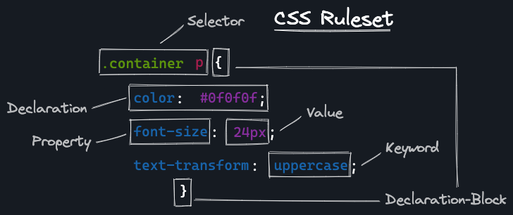

# CSS

## CSS Basics

<details>
<summary>Basics | LinkingStylesheet | multiple Stylesheets | BoxModel | Inline/Block | Selector | PseudoClass | PseudoElements | Combinator | StylingFonts | GoogleFonts</summary>

## CSS Basics



| Bereich     | Beschreibung                                             |
| ----------- | -------------------------------------------------------- |
| Selector    | Wählt das zu stylende Element                            |
| Declaration | Definiert das Styling durch `Eigenschafts`+`Werte`-Paare |
| Property    | Name der zu stylenden `Eigenschaft`                      |
| Value       | Der `Wert` einer zugehörigen `Eigenschaft`               |
| Keyword     | Wie `Value` // Keywords haben vordefinierte Funktionen   |

Es können **mehrere Elemente** mit **einem Ruleset** gestyled werden, sowie **mehrere Deklarationen** in einem **Ruleset** vorhanden sein:

```css
h1,
h2,
h3 {
  color: green;
  font-size: 12px;
}
```

---

### Linking Stylesheets

Simple implementation of seperated `styles.css`-file in `<head>` of the HTML document, so that styles get loaded into the browser before the Content does.

```html
<head>
  ...
  <link rel="stylesheet" href="./file/styles.css" />
</head>
```

> ❗️ Der `.` in/vor `"./file/styles.css"` ist wichtig, damit die Datei über den Dateipfad und nicht über die URL aufgerufen wird.  
> Kann sonst bei Domainwechsel für Probleme sorgen.

---

### multiple Stylesheets / Structure of documents

You can import one stylesheet into another stylesheet using **@import**:

```css
@import "customer-card.css";
```

Variables comes toether with all non-specific in `global.css`.
Styles for `header` in `./css/header.css` or sth. familiar

---

### Box Model

All elements of a website are wrapped in a **box model**. It's a way to define the size and position
of an element. There are four different parts: `content`, `padding`, `border` and `margin`.

| box model part | Function                                                 |
| -------------- | -------------------------------------------------------- |
| `content`      | The actual content of the element.                       |
| `padding`      | Space between the content and the border of the element. |
| `border`       | The border of the element.                               |
| `margin`       | The space around the border and other elements.          |

The property `box-sizing` changes the way how the `width` and `height` of an element is calculated.
The default value is `content-box`. The values of `width` and `height` set the size of the "content
box". With the value `border-box`, the size of the "border box" is set instead.

```css
* {
  box-sizing: border-box;
}
```

Now, the `width` property defines the size of the border box, padding and border width are
subtracted to calculate the available space for the content.


---

### Inline and Block elements

- **inline elements** nehmen den Platz ein, _den sie selbst benötigen_.  
   // platziert **in** text lines
- **block elements** nehmen den _gesamten horizontalen Platz_ des `<parent element>` ein.  
   // platziert in **neuer Zeile**

  ```html
  <!-- "h2" is a block-level element -->
  <h2>Coding Bootcamp</h2>
  <!-- "p" is a block-level element. The "a" inside is an inline-level element -->
  <p>
    If you want to participate in a bootcamp, visit
    <a href="https://www.neuefische.de">neuefische.de</a>
  </p>
  ```

````

  > 💡 Dieses Standartverhalten kann durch die `display` Eigenschaft verändert werden.
  > `display: flex | grid`


---

### Selectors

- **universal** -Selektor
  // wählt alles (kann durch **Combinators** gezielt eingesetzt werden):

```css
* {
  box-sizing: border-box;
}
````

> 💡 The property `box-sizing` changes the way how the `width` and `height` of an element is calculated.
> The default value is `content-box`. The values of `width` and `height` set the size of the "content
> box". With the value `border-box`, the size of the "border box" is set instead.  
> Now, the `width` property defines the size of the border box, padding and border width are subtracted to calculate the available space for the content.

---

- **element**/type -Selektor  
  // wählt HTML Elemente anhand ihres Typen:

```css
h1 {
}
```

---

- **.class** -Selektor  
  // wählt Elemente einer bestimmten Klasse:

```css
.box {
}
```

---

- **#ID** -Selektor  
  // wählt _ein Element_ mit eindeutiger ID:

```css
#unique {
}
```

---

- **attribute** -Selektor  
  // wählt Elemente anhand ihres Attributes:

Alle Elemente generell mit `type` -Attribut:

```css
[type] {
}
```

Alle Elemente mit `type` -Attribut und dazugehörigem Wert `"button"`:

```css
[type="button"] {
}
```

Alle `a` -Elemente mit `href` -Attribut **_beginnend_** mit Wert `"https"`:

```css
a[href^="https"] {
}
```

> 🧩 BestPractise:  
> .class-Selektor hauptsächlich benutzen  
> #ID-Selektor **nicht** für styling

> 💡 Selector hierachy:
> ❗️ Hier fehlt noch ein Teil, der bald kommt und an diese Stelle gehört ❗️

---

### Pseudo Classes

Sometimes we want to style an HTML element differently when it is in a specific state. This can be
accomplished by **pseudo classes**. These are added to a selector and start with a **:** colon. Here
are some examples of states that can be styled with pseudo classes:

- hovered elements

  ```css
  h2:hover {
    ...;
  }
  ```

- active elements like a pressed button

  ```css
  button:active {
    ...;
  }
  ```

- links that have been visited

  ```css
  a:visited {
    ...;
  }
  ```

- form input that has received focus.

  ```css
  input:focus {
    ...;
  }
  ```

- elements which are the first child in another element

  ```css
  li:first-child {
    ...;
  }
  ```

- elements which are the nth child in another element. **n** is the argument that you can replace
  for example with a number or the words **even** and **odd**.

  ```css
  li:nth-child(n) {
    ...;
  }
  ```

> 💡 There are many more of these pseudo classes which can be looked up
> [in the MDN web docs](https://developer.mozilla.org/en-US/docs/Web/CSS/Pseudo-classes).

---

### Pseudo Elements

In comparison to **pseudo classes**, **pseudo elements** let you style a specific part of the
selected elements like the first line of a paragraph, the first-letter, the selection etc. Similar
to pseudo classes they are written with **::** double colons directly after the original selector.

- this selects the first line of paragraphs

  ```css
  p::first-line {
    ...;
  }
  ```

- this creates pseudo elements as the first child of the selected elements

  ```css
  a::before {
    content: "🌍"; // property needed, can be empty
  }
  ```

- this creates pseudo elements as the last child of the selected elements

  ```css
  a::after {
    content: "📎"; // property needed, can be empty
  }
  ```

> 💡 [In the MDN dev docs](https://developer.mozilla.org/en-US/docs/Web/CSS/Pseudo-elements) you can
> find even more pseudo elements.

---

### Combinators

- **descendant** -Combinator `"  "`  
  // jedes `p`-Element, verschachtelt in `allen Ebenen` von `.class`

```css
.class p {
}
```

---

- **child** -Combinator `>`  
  // jedes `p` -Element, verschachtelt in `1. Ebene` von `.class`

```css
.class > p {
}
```

---

- **general sibling** -Combinator `~`  
  // **jedes** `p` -Element, das einem `img` -Element folgt  
  // und `in der selben verschachtelten Ebene` steckt. Bzw. `gleiches Parent-Element` hat

```css
img ~ p {
}
```

---

- **adjacent sibling** -Combinator `+`  
  // **jedes _erste_** `p` -Element, das einem `img` -Element folgt  
  // und `in der selben verschachtelten Ebene` steckt. Bzw. `gleiches Parent-Element` hat

```css
img + p {
}
```

---

### Styling fonts

With CSS you can style the fonts of your website in many ways. Here are just some examples:

- `font-family`: Defines the font family of an element
- `font-size`: Size of a font
- `font-weight`: This property defines the weight of a font

You can include custom fonts in different ways:

- download any font and include it as a `font-family`

  ```css
  @font-face {
    font-family: "Name of the font";
    src: url("path/to-the/font.woff");
  }
  ```

  You can use the [google webfonts helper](https://google-webfonts-helper.herokuapp.com/fonts) which
  will provide you with the fonts file and create the necessary css rules for you.

- the `@import` snippet ([see legal notice below](./css-basics.md#legal-issues-using-google-fonts-with-import-and-link))
- the HTML `link` element ([see legal notice below](./css-basics.md#legal-issues-using-google-fonts-with-import-and-link))

> ❗️ For legal reasons you should choose the option to download the font and include it as a
> font-family.

### Legal Issues using Google Fonts with `@import` and `<link>`

[Google Fonts](fonts.google.com) is an open source project where you can find a font. The website provides you with two easy ways to host fonts in your project:

- the `@import` snippet
- the HTML `link` element

If you use one of these two ways, your website requests the font from the Google Server as soon as the website loads. To do so, the Google server needs to know the user's IP address.

The IP address, however, is considered personally identifiable data and in January 2022, a German court has declared that Google Fonts is not [GDPR](https://gdpr.eu/)-compliant (DSGVO).

And that's the point: the website has communicated with an (external) Google server without asking the user's permission (i.e. before the user agreed that the website uses cookies).

This is why using Google Fonts with `@import` or the HTML `link` element, every user can sue you for violating their personal data.

> 💡 In the future (towards your capstone project) we're going to use a web framework called Next.js. It provides an easy way to integrate downloaded Google Fonts automatically without getting into legal trouble. Please wait a few more weeks as we can't use that right now. We'll get there though. 🤞

---

---

</details>
<!-- ---------- ---------- ---------- ---------- ---------- ---------- -->
<!-- ---------- ////////// ---------- ---------- ////////// ---------- -->
<!-- ---------- ---------- ---------- ---------- ---------- ---------- -->

## CSS Structure

<details><summary>Cascade | Specificity | BestPractise | BEM | KebabCase-Naming | CustomProperties</summary>

## CSS Structure

### CSS Cascade

The cascade is the algorithm that defines which CSS rules are being applied when there are
conflicting rules.

When styling an element the browser:

1. Searches for all rules with matching selectors
2. Sorts the rules by their importance taking into account:
   - Whether the declaration is followed by **!important**
   - The rule's origin (Browser stylesheet, User stylesheet, Author stylesheet)
3. Sorts rules by their [specificity](#specificity), if there are multiple rules with the same
   importance according to no. 2.
4. Chooses the last declaration over previous ones, if there are multiple rules with the same
   importance and the same specificity.

You can read about the details in the
[CSS Cascade mdn docs](https://developer.mozilla.org/en-US/docs/Web/CSS/Cascade).

> ❗️ We recommend never using !important unless you absolutely have to. It is almost impossible to
> overwrite a CSS rule with !important.

---

### Specificity

The specificity of a CSS selector tells the browser which rule is most relevant for an element. The
more specific rules win over less specific ones.

You can find a list of the specificity of different selectors on
[specifishity.com](https://specifishity.com/).

The **universal selector** is the lease specific one. It is overwritten by any other CSS rule with
any other matching CSS selector.

**type selectors** like `div` have a low specificity and can easily be overwritten.

**class selectors** like `.bright` and **attribute selectors** like `[type=checkbox]` have a higher
specificity.

---

### CSS Structure best practices

- keep your CSS consistent throughout a project. In collaborative projects, there are often coding
  style guidelines.
- separate global and local styles into different files (or sections of files)
- create multiple stylesheets for different parts of your application
  - structure your code by thinking in reusable **components**. You can write your CSS for every
    component in its own CSS file.

### How to import one stylesheet or multiple stylesheets into another stylesheet

You can import one stylesheet into another stylesheet using **@import**:

```css
@import "customer-card.css";
```

---

### BEM

BEM is short for "Block, Element, Modifier". It is a method that allows you to craft reusable
components through CSS class naming conventions.

```css
.block {
  ...;
}

.block__element {
  ...;
}

.block--modifier {
  ...;
}
```

A **block** is a standalone entity or component.

An **element** is a part of your block (or component) that has no standalone meaning.

A **modifier** is a flag on your block (or component) that is used to change its appearance or
behavior. E.g. disabled, checked, bright, etc. .

You can find an [introduction to BEM here](http://getbem.com/introduction/).

### Kebab Case naming convention

The kebab case naming convention defines to use hyphens to separate words in variables. Many
developers use the kebab case convention to write css classes. In BEM we also use kebab case, for
example:

```css
.customer-card {
  ...;
}

.customer-card__button {
  ...;
}

.customer-card--disabled {
  ...;
}
```

---

### Custom properties (CSS variables)

You can store values in custom properties, so you can use them again multiple times without having
to write the value.

A common practice is to define variables in the `:root` pseudo class selector as follows:

```css
:root {
  --primary-color: #ff00ff;
  --secondary-color: #f00f0f;
}
```

> ❗️ Custom properties have to be prefixed with `--`

You can use the custom properties as follows:

```css
.customer-card {
  color: var(--primary-color);
  background-color: var(--secondary-color);
}
```

---

#### Resources

- [MDN docs: CSS Cascade](https://developer.mozilla.org/en-US/docs/Web/CSS/Cascade)
- [specifishity.com](https://specifishity.com/)
- [Introduction to BEM](http://getbem.com/introduction/)

</details>
<!-- ---------- ---------- ---------- ---------- ---------- ---------- -->
<!-- ---------- ////////// ---------- ---------- ////////// ---------- -->
<!-- ---------- ---------- ---------- ---------- ---------- ---------- -->

## CSS Positioning

<details>
<summary>Positioning | FlexBox | Grid</summary>

## CSS Positioning

### Positioning

The position property comes in handy if you want to place an HTML element manually. There are 5
different values to define the position:

| Type                 | Description                                                                                                         |
| -------------------- | ------------------------------------------------------------------------------------------------------------------- |
| `position: static`   | The position of the element is determined by the document flow (default)                                            |
| `position: relative` | Position the element relative to where the element would be placed normally                                         |
| `position: absolute` | Position the element absolutely inside the **nearest non-static ancestor element**                                  |
| `position: fixed`    | Position the element on a fixed position on the screen.                                                             |
| `position: sticky`   | The element is placed normally in the document flow, but keeps an offset relative to its nearest scrolling ancestor |

The position is then specified by the four position properties `top`, `bottom`, `right`, `left`.
These work differently depending on the positioning method.

---

### `position: static`

Elements are positioned according to the normal document flow. The properties `top`, `bottom`,
`right`, `left` have no effect. This is the default value.

---

### `position: relative`

Elements are positioned according to the normal document flow and then displaced by the `top`,
`bottom`, `right`, `left` properties. This method is also used to set the reference frame for an
absolutely positioned child element. By doing so, the child element will be placed absolutely inside
this element.


### `position: absolute`

Elements are removed from the normal document flow and no space is created for them - so they leave
no gap in the page. With position absolute you place an element (with the `top`, `bottom`, `right`,
`left` properties) relative to a reference frame. The reference frame is the view-box of the closest
ancestor element that does not have `position: static` (default).

In the picture below you can see two examples.

In the first, no non-static ancestor element exists, therefore the reference frame falls back to the
page.

In the second example, the element is inside another element with `position: relative`. Therefore,
the element is placed absolutely towards this element and not the entire page.


---

### `position: fixed`

Elements are removed from the normal document flow and no space is created for them - so they leave
no gap in the page. An element with position fixed is not influenced by scrolling and therefore
stays at the specified position. This is often used for navigation bars or "back to top" buttons.


---

### `position: sticky`

This is an unusual but very nifty positioning method. The element is not affected by the positioning
until it comes near the border of its scrolling container (normally the page itself). When the user
continues scrolling, a specified offset is enforced. The element sticks to this offset and appears
like a fixed element.


---

### `z-index`

The z-index defines the stacking order of html elements. Elements with a higher stacking order
appear on top if they overlap with other elements. The z-index can be an integer number (negative
numbers are possible) or it can have the default value `auto` which sets the stack order equal to
its parents. The z-index only effects positioned elements - that is elements with a non-static
position value.

---

#### Resources

- [MDN web docs: position](https://developer.mozilla.org/en-US/docs/Web/CSS/position)
- [MDN web docs: Using positioning](https://developer.mozilla.org/en-US/docs/Learn/CSS/CSS_layout/Positioning)
- [MDN web docs: z-index](https://developer.mozilla.org/en-US/docs/Web/CSS/z-index)
- [MDN web docs: Using z-index](https://developer.mozilla.org/en-US/docs/Web/CSS/CSS_Positioning/Understanding_z_index/Adding_z-index)
- [MDN web docs: Stacking context](https://developer.mozilla.org/en-US/docs/Web/CSS/CSS_Positioning/Understanding_z_index/The_stacking_context)
- [`z-index` and stacking context by Josh W. Comeau](https://www.joshwcomeau.com/css/stacking-contexts/)

---

---

## Flexbox

Flexbox is a powerful CSS tool to layout your HTML elements, especially when you want to align
elements horizontally. It is defined on a container element, containing multiple elements whose
position will be determined by the flexbox rules. You define it as follows:

```css
.container-element {
  display: flex;
}
```

Flexbox does the following:

- All child elements will be displayed next to each other along the main axis, the horizontal axis
  by default. The perpendicular axis is called cross axis.
- If the width of all child elements exceeds the container's width, the child elements will be
  shrunk such that they all fit into the available space.

This behavior can be modified to achieve some very useful layouts. The most important flex
properties are listed in the following table.

---

### Important Flex Properties

| property                                                                            | effect                                                                                                                                       |
| ----------------------------------------------------------------------------------- | -------------------------------------------------------------------------------------------------------------------------------------------- |
| [justify-content](https://developer.mozilla.org/en-US/docs/Web/CSS/justify-content) | Defines the positioning of elements along the main axis. Useful values: `flex-start`, `flex-end`, `center` , `space-between`, `space-evenly` |
| [align-items](https://developer.mozilla.org/en-US/docs/Web/CSS/align-items)         | Defines the positioning of elements along the cross axis. Useful values: `flex-start`, `flex-end`, `center`                                  |
| [gap](https://developer.mozilla.org/en-US/docs/Web/CSS/gap)                         | Defines the minimum spacing between elements.                                                                                                |
| [flex-direction](https://developer.mozilla.org/en-US/docs/Web/CSS/flex-direction)   | Sets the direction of the main axis. Useful values: `row`, `column`                                                                          |
| [flex-wrap](https://developer.mozilla.org/en-US/docs/Web/CSS/flex-wrap)             | Modifies how elements can wrap into another row instead of being squashed into one row. Useful values: `wrap`, `no-wrap`                     |

> 💡 [This very detailed cheatsheet](https://css-tricks.com/snippets/css/a-guide-to-flexbox/)
> includes everything you will ever need when working with flexbox.

---

### Flex-direction

This very fundamental property lets you define which axis should act as main axis. In this picture
you can see its effect.


As you can see it changes the layout completely. Also notice, that the property `align-items`, which
defines the positioning on the cross axis, also changes with the definition of the flex-direction.

---

### Flex-wrap

This property is very useful for creating responsive layouts. With the property set to
`flex-wrap: wrap` the elements flow into the next row when they wouldn't fit into the current row.
Depending on the screen width, the content can align itself, as shown in the following example.


---

#### Resources

- [Flexbox Cheat Sheet](https://css-tricks.com/snippets/css/a-guide-to-flexbox/)
- [MDN web docs: Flexbox](https://developer.mozilla.org/en-US/docs/Learn/CSS/CSS_layout/Flexbox)
- [CSS Battle](https://cssbattle.dev/)

---

---

### Grid

### CSS Grid Layout

With [CSS Grid Layout](https://developer.mozilla.org/en-US/docs/Web/CSS/CSS_Grid_Layout), you can
position HTML elements in a grid structure, reposition individual elements, stretch items across
multiple cells and much more. It's a very powerful layout tool.

Working with CSS Grid Layout contains two major parts:

1. Defining the layout on a container element
1. Positioning the children on the grid cells

### Grid container

Just like CSS flexbox, the display mode is defined on a container element that contains all the
elements to be positioned as direct children in the grid.

```css
.container {
  display: grid;
}
```

The grid is defined by the number and size of it's rows and columns. By default, the grid consists
of one column. The properties for defining the columns and rows are
[grid-template-columns](https://developer.mozilla.org/en-US/docs/Web/CSS/grid-template-columns) and
[grid-template-rows](https://developer.mozilla.org/en-US/docs/Web/CSS/grid-template-rows). With the
[gap](https://developer.mozilla.org/en-US/docs/Web/CSS/gap) property you can define a space between
the grid cells.

### `fr` Unit

The grid layout has the fraction unit `fr` as a special sizing unit (next to `px`, `rem` or `%`)

1. It splits the remaining space in a grid into equally sized fractions. The number of these parts
   is determined by the total amount of fraction units distributed in the row/column template.
2. The individual rows / columns take up the assigned number of fractions.

In the following picture, the last two columns are sized with fraction units. The first of them has
twice the width of the second one.


### Element Positioning

After the grid is set up on the container element, its children are placed inside the grid cells
from left to right, top to bottom. By default, the elements are stretched such that they take up all
the available cell space.


You can change an element's positioning by using the the CSS properties
[grid-column](https://developer.mozilla.org/en-US/docs/Web/CSS/grid-column),
[grid-rows](https://developer.mozilla.org/en-US/docs/Web/CSS/grid-row) or
[grid-area](https://developer.mozilla.org/en-US/docs/Web/CSS/grid-area), which combines the former
into a single CSS shorthand property. Elements can also be stretched over multiple cells.

Each element can be positioned on the columns and rows by using these values:

1. **Column / row index** (see picture above).
2. Negative **index**. Indexing the lines from the other side.
3. The **`span`** value. Defines how many cells the item should stretch across.

Here is an example:


> ❗️ Positioning properties are set on the child elements, not on the container!

### `grid-template-areas`

A completely different approach to position elements inside a grid is to use `grid-template-areas`.

- First the template cells are grouped into named areas. Every created cell is assigned an **area
  name**. Cells with the same name are grouped together to one area. This is done on the container
  element:
  ```css
  grid-template-areas:
    "a a b c"
    "d d d c"
    "e e e e";
  ```
- Then the grid elements are assigned to one of these areas with the `grid-area` property:
  ```css
  .element-a {
  	grid-area: a;
  }
  .element-b {
  	grid-area: b;
  }
  ...
  ```

This will result in the same layout as shown above.

> ❗️ Make sure that the named areas are geometrically possible in the defined grid, otherwise your
> grid won't work.

### Column and Row Alignment

The combined size of the grid columns/rows you defined might be less than a given height/width of
the grid container. In this case you can distribute the columns or rows inside the grid container.

| Property                                                                            | Effect                                          |
| ----------------------------------------------------------------------------------- | ----------------------------------------------- |
| [justify-content](https://developer.mozilla.org/en-US/docs/Web/CSS/justify-content) | Sets the alignment of the `columns`.            |
| [align-content](https://developer.mozilla.org/en-US/docs/Web/CSS/align-content)     | Sets the alignment of the `rows`.               |
| [place-content](https://developer.mozilla.org/en-US/docs/Web/CSS/place-content)     | Sets the alignment of the `rows` and `columns`. |

### Cell Alignment

The position of the elements _inside_ their cells can be specified on the grid container.

| Property                                                                        | Effect                                          |
| ------------------------------------------------------------------------------- | ----------------------------------------------- |
| [justify-items](https://developer.mozilla.org/en-US/docs/Web/CSS/justify-items) | Sets the `horizontal` alignment.                |
| [align-items](https://developer.mozilla.org/en-US/docs/Web/CSS/align-items)     | Sets the `vertical` alignment.                  |
| [place-items](https://developer.mozilla.org/en-US/docs/Web/CSS/place-items)     | Sets the `vertical` and `horizontal` alignment. |

---

#### Resources

- [Complete Guide to CSS Grid](https://css-tricks.com/snippets/css/complete-guide-grid/)

---

---

</details>
<!-- ---------- ---------- ---------- ---------- ---------- ---------- -->
<!-- ---------- ////////// ---------- ---------- ////////// ---------- -->
<!-- ---------- ---------- ---------- ---------- ---------- ---------- -->

## CSS Responsive

<details>
<summary>MobileFirst | ResponsiveUnits | MediaQueries | MediaTypes | ScreenSize | Orientation | Pointer | PixelDensity | ColorScheme | ReducedMotion | HighContrast | CombiningMediaFeatures | Testing | Simulating | CommonBreakpoints | DifferentImages</summary>

### Mobile First Design

When authoring CSS, it's a very helpful convention to first define all your mobile styles, and then
add media queries to adjust the styles for larger screens. It's easier to reason about, and it
results in a simpler CSS structure. Your code will be more similar to the way other people write
CSS.

When designing, it makes sense to begin designing mobile first, because most users are on mobile
devices. This also helps you to focus on the most important information (you have less space), and
to structure it in a way that makes sense for mobile users.

---

### Responsive Units

Responsive units are units that are relative to the size of the viewport, the current font size, or
the size of their parent element.

- `vh` (viewport height): 1vh is 1% of the viewport height
- `vw` (viewport width): 1vw is 1% of the viewport width
- `em`: 1em is the font size of the **current element**
- `rem`: 1rem is the font size of the **root element**
- `%`: is relative to the related property of the parent or current element - every property has
  it's own rules what it is relative to:
  - `width: 1%` is set relative to the parents element width
  - `padding-top: 10%` means 10% of the parents height
  - `font-size: 50%` means half as big as the parent font-size
  - `transform: translateX(50%)` means translate on the x axis by 50% of the current elements width
- `calc()`: allows you to combine multiple units and do math
  - e.g. `calc(100vh - 100px)`
  - or `calc(50% - 10rem)`

---

### Media Queries

Media queries allow you to write CSS for specific media types, screen sizes, orientations and more.

They follow the following syntax:

```css
@media (media feature) {
  /* CSS rules */
}
```

---

### Media Types

You can target a specific media type with the `screen` and `print` media types.

```css
@media screen {
  /* CSS rules that are only applied on screens */
}
@media print {
  /* CSS rules that are only applied when printing */
}
/* ohne scheiss: ausdrucken :P */
```

---

### Screen Size

You can target specific screen sizes with the `min-width` and `max-width` media features.

> 💡 `min-width: 768px` is a typical value here

> 🧩 Best practise: begin with **small** screensize, before heading to bigger ones

```css
@media (min-width: 600px) {
  /* CSS rules that are only applied when the screen is at least 600px wide */
}
@media (max-width: 600px) {
  /* CSS rules that are only applied when the screen is at most 600px wide */
}
```

> 💡 Avoid `max-width` media queries, because they are harder to reason about. It's easier to think
> about the smallest screen size first, and then add media queries for larger screens.

---

### Orientation

You can target specific orientations with the `orientation` media feature.

> 💡 `orientation: **portrait**` Gerät ist hochkant
> `orientation: **landscape**` Gerät liegt queer

```css
@media (orientation: portrait) {
  /* CSS rules that are only applied when the screen is in portrait orientation */
}
@media (orientation: landscape) {
  /* CSS rules that are only applied when the screen is in landscape orientation */
}
```

> 💡 You can also target a specific aspect ratio with the
> [`aspect-ratio` media feature](https://developer.mozilla.org/en-US/docs/Web/CSS/@media/aspect-ratio).

---

### Pointer

You can target specific pointer types with the `any-pointer` media feature.

```css
@media (any-pointer: none) {
  /*
		CSS rules that are only applied when the device has no pointer
		(neither touch nor cursor)
	*/
}
@media (any-pointer: coarse) {
  /*
		CSS rules that are only applied when the device has a coarse pointer
		(mostly touch)
	*/
}
@media (any-pointer: fine) {
  /*
		CSS rules that are only applied when the device has a fine pointer
		(cursor)
	*/
}
```

---

### Device Pixel Ratio (Pixel Density)

You can target specific device pixel ratios with the `device-pixel-ratio` media feature.

```css
@media (device-pixel-ratio: 1) {
  /*
		CSS rules that are only applied when the device has a pixel ratio of 1
		(mostly older screens)
	*/
}
@media (device-pixel-ratio: 2) {
  /*
		CSS rules that are only applied when the device has a pixel ratio of 2
		(newer screens like the retina screen on your MacBook)
	*/
}
@media (device-pixel-ratio: 3) {
  /*
		CSS rules that are only applied when the device has a pixel ratio of 3
		(some high resolution tablets and phones)
	*/
}
```

---

### Color Scheme

You can target specific color schemes with the `prefers-color-scheme` media feature.

```css
@media (prefers-color-scheme: dark) {
  /* CSS rules that are only applied when the user prefers a dark color scheme */
}
@media (prefers-color-scheme: light) {
  /* CSS rules that are only applied when the user prefers a light color scheme */
}
```

> 💡 You can change your preferred color scheme in your operating system settings. On macOS, you can
> do this in System Preferences > General > Appearance.

---

### Reduced Motion

You can target users who are sensitive to animations and movement (and set up their system
accordingly) with the `prefers-reduced-motion` media feature.

```css
@media (prefers-reduced-motion: reduce) {
  /* CSS rules that are only applied when the user prefers reduced motion */
}
```

> 💡 You can change your preferred reduced motion setting in your operating system settings. On
> macOS, you can do this in System Preferences > Accessibility > Display > Reduce motion.

---

### High Contrast

You can target users who prefer a higher contrast with the `prefers-contrast` media feature.

```css
@media (prefers-contrast: more) {
  /* CSS rules that are only applied when the user prefers a higher contrast */
}
```

> 💡 You can change your preferred contrast setting in your operating system settings. On macOS, you
> can do this in System Preferences > Accessibility > Display > Increase contrast.

---

### Other Media Features

There are also media features for other (accessibility) features, like
[`inverted-colors`](https://developer.mozilla.org/en-US/docs/Web/CSS/@media/inverted-colors). The
list of all media features is always growing. Check out
[the full list](https://developer.mozilla.org/en-US/docs/Web/CSS/@media#media_features) on mdn.
--

### Combining Media Features

You can combine multiple media features with `and`.

```css
@media (min-width: 600px) and (orientation: landscape) {
  /* CSS rules that are only applied when the screen is at least 600px wide and in landscape orientation */
}
```

---

### Testing for multiple Media Features

You can use a comma-separated list to apply styles when the user's device matches **any one of various**
media types using `,`

```css
@media (min-width: 600px), (orientation: portrait) {
  /* CSS rules that are only applied when the screen is either at least 680px high or in portrait orientation */
}
```

---

### Simulating Media Features

You can simulate media features in the browser devtools. For example, you can change your screen
size in the devtools by clicking the device icon in the top left corner of the devtools.

---

### Common Breakpoints

When using `min-width` media queries it can be helpful to use common breakpoints.

- no media query (default): extra-small, xs, mobile
- `(min-width: 600px)`: small, sm, large mobile
- `(min-width: 900px)`: medium, md, tablet
- `(min-width: 1200px)`: large, lg, desktop
- `(min-width: 1536px)`: extra-large, xl, large desktop

> 💡 These breakpoints are based on the
> [MUI breakpoints](https://mui.com/material-ui/customization/breakpoints/). Other frameworks and
> projects might define a completely different set of breakpoints. Mostly they are defined to be
> between the most common screen sizes. Another example for common breakpoints are
> [the ones from Tailwind CSS](https://tailwindcss.com/docs/breakpoints).
> 🪄 **Pro Tip**: You can use media queries to redefine the values of CSS custom properties. This way
> you can use the property as a value that dynamically changes based on the media query.

```css
:root {
  --font-size: 12px;
}
@media (min-width: 600px) {
  :root {
    --font-size: 16px;
  }
}
@media (min-width: 1200px) {
  :root {
    --font-size: 20px;
  }
}
body {
  font-size: var(--font-size);
}
```

---

### Showing different images based on media queries

You can use media queries to show different images based on the screen size.

> 💡 The html **`picture` element** allows you to define multiple `source` elements for an image. The browser
> will choose the _first_ source that matches the given media query. If no `source` element matches,
> the browser will use the `img` element as a fallback.

The `img` element is required, so that there is always a fallback.

```html
<picture>
  <source
    media="(min-width: 1200px)"
    srcset="https://source.unsplash.com/random/1400x1050"
  />
  <source
    media="(min-width: 900px)"
    srcset="https://source.unsplash.com/random/800x600"
  />
  
</picture>
```

> 💡 Note that the `source` element doesn't have a `src` attribute but uses the `srcset` attribute
> instead. This can be used to help with performance but is not relevant for this session.

---

#### Resources

- [Using Media Queries](https://developer.mozilla.org/en-US/docs/Web/CSS/Media_Queries/Using_media_queries)
- [Responsive Design on mdn](https://developer.mozilla.org/en-US/docs/Learn/CSS/CSS_layout/Responsive_Design)
- [Responsive Web Design Basics on web.dev](https://web.dev/responsive-web-design-basics/)
- [Values and Units on mdn](https://developer.mozilla.org/en-US/docs/Learn/CSS/Building_blocks/Values_and_units)
- [Beginner's Guide to Media Queries on mdn](https://developer.mozilla.org/en-US/docs/Learn/CSS/CSS_layout/Media_queries)
- [@media on mdn](https://developer.mozilla.org/en-US/docs/Web/CSS/@media)
- [The Picture element on mdn](https://developer.mozilla.org/en-US/docs/Web/HTML/Element/picture)
- [Is your web page mobile-friendly? on Google](https://search.google.com/test/mobile-friendly)

---

---

</details>
<!-- ---------- ---------- ---------- ---------- ---------- ---------- -->
<!-- ---------- ////////// ---------- ---------- ////////// ---------- -->
<!-- ---------- ---------- ---------- ---------- ---------- ---------- -->
