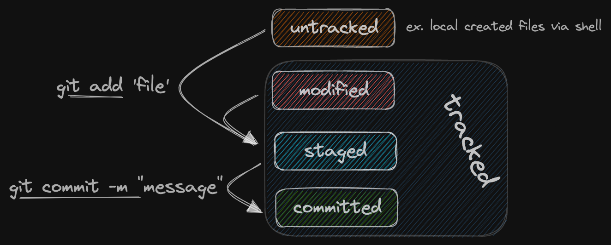

# GIT (cli + remote)

## GIT CommandCollection

| command                                                                 | action                                          |
| ----------------------------------------------------------------------- | ----------------------------------------------- |
| git add                                                                 | Änderung auf die Stage bringen                  |
| git branch                                                              | branches auflisten                              |
| git branch -a                                                           | branches remote u. lokal auflisten              |
| git branch -d branchname                                                | branch löschen                                  |
| git branch -m main                                                      | branch in main ändern, falls alte masterversion |
| git clone fileurl                                                       | git aus GitHub clonen                           |
| git commit -m "text"                                                    | Commit mit Kommentar                            |
| git log --oneline                                                       | commit history anzeigen                         |
| git pull                                                                | aktuelle Version von Github ziehen              |
| git push origin --delete remoteBranchName                               | Branch auf Github löschen                       |
| git push -u origin branchname                                           | allererste Änderung auf Github pushen           |
| git push                                                                | Änderungen an bereits gepushtem git pushen      |
| git remote add origin git@github.com:GitHubUsername/repository-name.git | x                                               |
| git restore .                                                           | zum letzten Commit zurück kehren                |
| git restore filename                                                    | Datei wieder herstellen                         |
| git rm filename                                                         | Datei löschen                                   |
| git set-url origin                                                      | origin url neu vergeben                         |
| git status                                                              | status von dateien                              |
| git switch branchname                                                   | zu anderem branch wechseln                      |
| git switch -c branchname                                                | neuen branch erstellen                          |

## GIT cli (CommandLineInterface)

`cd path/to/folder` navigate to your folder  
`git init` initializes / creates a **local repository**

> ❗️ do **not initialize** / create a git repository **inside another** git repository!  
> Check: `git status`

---

### states of files

- **untracked** files  
  // files, that have _not been added_ to git. e.g. **local created** files
- **tracked** files  
  // files can be in different tracked **states** - **modified** - _added_ once to git **and** has _changes_ since last commit - **staged** - _included_ in next commit - **committed** - all changes _saved_ in git (maybe `git push` it to remoteRepo)



---

### commits

**snapshot** of repository **at a specific point in time**, similar to hitting **save button** in games, have a message to let other developers know about changes being made


> 💡 Good commit messages:
>
> - short and descriptive
> - always use english
> - first word is a verb, eg.: add, fix, remove, etc.
> - imperative and present tense, eg.: add shop page
> - don't end with a period
> - in doubt explain why you did something and not how

> ❗️ **Don't do that**, exept there is no other way: ❗️  
> reset to a _previous_ commit:
>
> > - `git log --oneline` to get commit's ID
> > - double-check the next one!
> > - `git reset 89f6c3e --hard` to **hard reset** to specific commit

---

### branches

When working on a project, especially as a team, you want to work on features independently, so they never affect anyone else's work. Git offers us branches to keep our current work away from a teams common codebase until completion.

A branch lets you split from the main line of development. The new branch shares a part of its commit history with the main branch. At a certain commit the new branch branches off and the commit histories differ.  


---

## GIT remote (GitHub, GitLab, ...)

### Connecting your local repository to a new remote repository

The first thing you need to do is create a new empty remote repository on **GitHub**. You will then see
some hints e.g. "...or push an existing repository from the command line". **Copy the commands from
GitHub** and execute them in your local project folder.

**Example:**

```shell
git remote add origin git@github.com:GitHubUser/repository-name.git
git branch -M main # optional; some versions still use master as main
git push -u origin main
```

### Cloning a remote repository

You can create a copy of the remote repository on your local machine with the following command:

```shell
git clone <url>
```

> 💡 You can find the url of remote repositories on GitHub on the repository page. Please use the
> SSH url.
> 

### Synchronizing local & remote repositories

| Git command | Git task                                    |
| ----------- | ------------------------------------------- |
| `git push`  | Upload content to the remote repository     |
| `git pull`  | Download content from the remote repository |

---

## Resources

- [Connect with SSH Docs on GitHub](https://docs.github.com/en/authentication/connecting-to-github-with-ssh/about-ssh)
- [Git SCM](https://git-scm.com/)
- [Git book](https://git-scm.com/book/en/v2)
- [Git Cheatsheet](https://training.github.com/downloads/github-git-cheat-sheet/)
